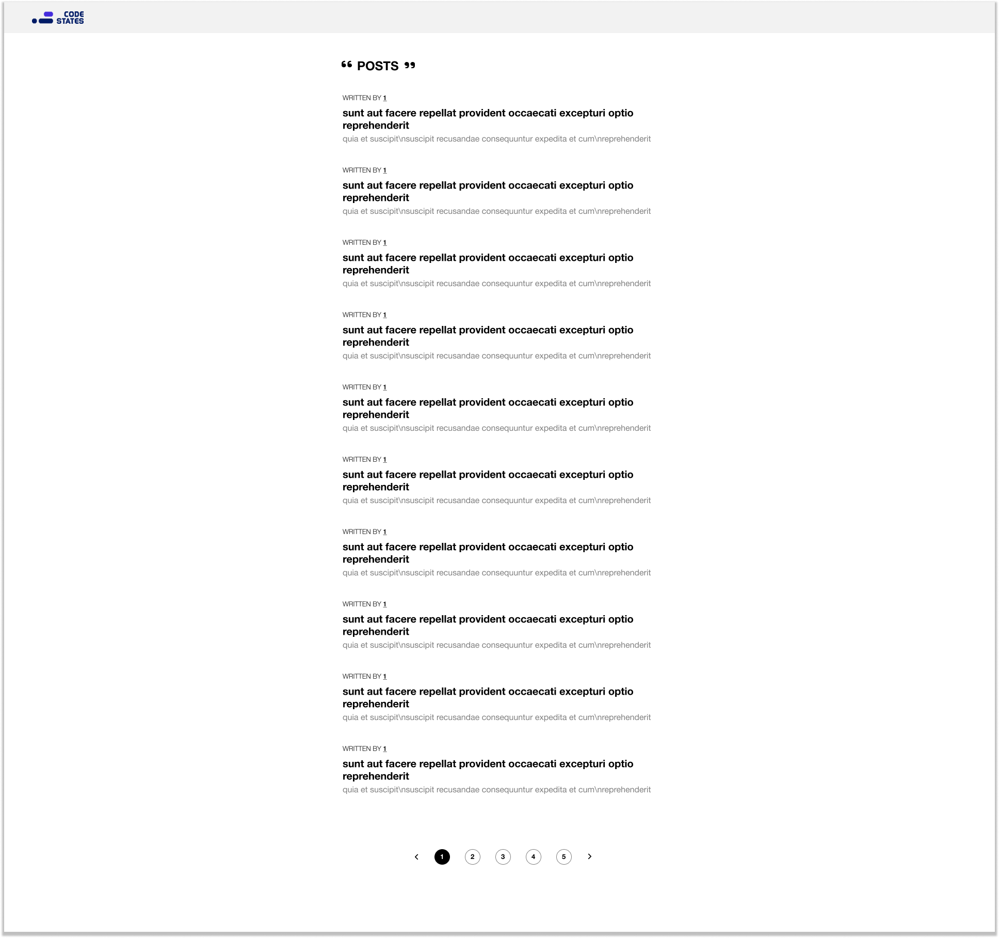
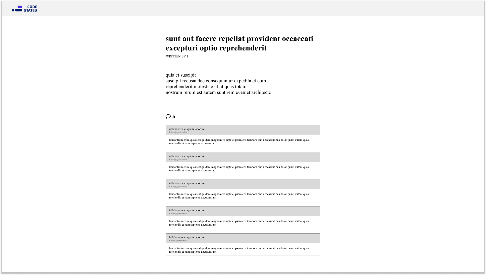
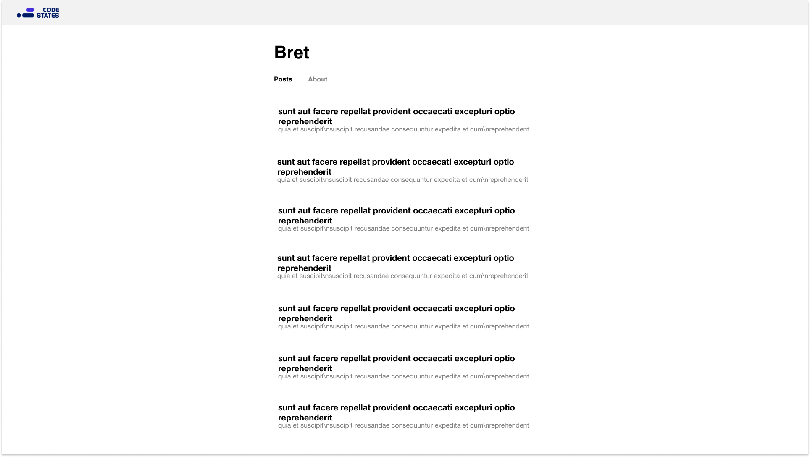
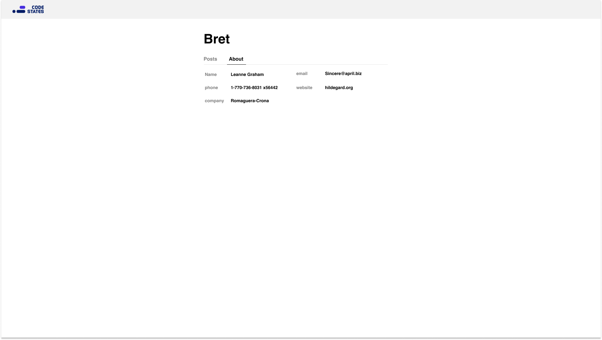
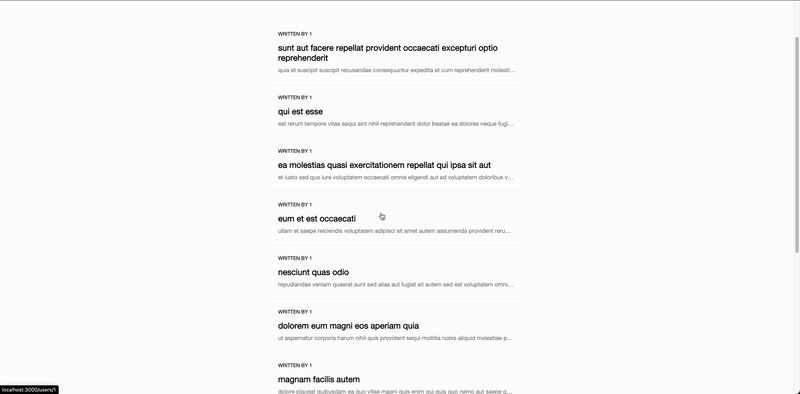
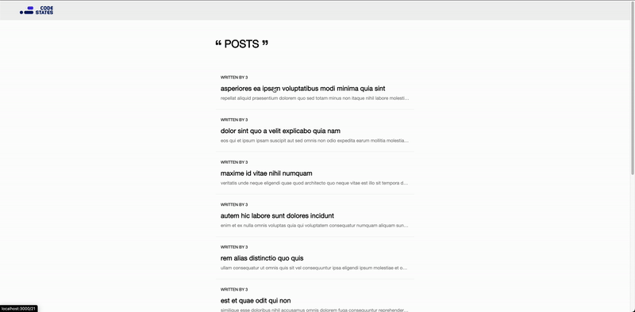
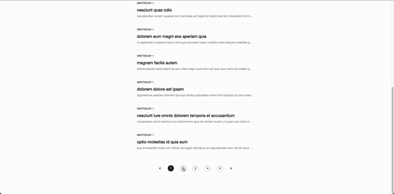
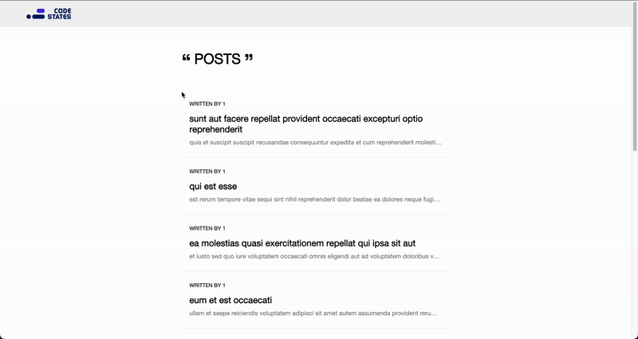
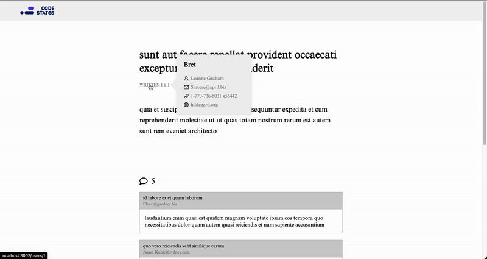

## Codestates FE advanced course 과제

### 0. 배포링크

---

<br/>

### 1. 프로토타입

---

- **[피그마 링크](https://www.figma.com/file/LzHvNF0wNc6Q0JR6zGr5hU/codestates-fe-advanced-course?node-id=0%3A1)**

- **게시물 리스트 및 페이지네이션**  
  

- **게시물 상세페이지**  
  

- **유저 상세페이지(유저가 쓴 글)**  
  

- **유저 상세페이지(유저 상세정보)**  
  

<br/>

### 2. 사용한 스택

---

- React
- Emotion
- axios

<br/>

### 3.1 필수로 구현한 기능

---

- **게시물 리스트**  
  

- **게시물 상세페이지**  
  

<br/>

### 3.2 추가로 구현한 기능(설명포함)

---

- **페이지네이션**  
     
  페이지네이션은 이번 목데이터가 페이지별로 데이터를 불러올 수 없었기 때문에  
  전체 데이터를 모두 가져온 다음 현재 페이지에 해당하는 10개의 자료를 잘라서 화면에 나타냈습니다

```javascript
{
  postList
    .slice(10 * (page - 1), 10 * page)
    .map((postInfo) => <Post key={postInfo.id} postInfo={postInfo} />);
}
```

<br/>

- **작성자 이름에 마우스를 올리면 간단한 유저 정보 확인**  
    
  작성자 이름에 onMouseEnter과 onMouseLeave에 이벤트를 설정하여  
  마우스를 올리면 모달안의 유저 정보를 불러오게끔 하였습니다

```html
<div
  className="modal"
  css={visible ? modalOnStyle : modalOffStyle}
  onMouseEnter={() => {
    toggleVisible(true);
  }}
  onMouseLeave={() => {
    toggleVisible(false);
  }}
>
  ...
</div>
```

- **유저 상세페이지**  
    
  목데이터 중에서 유저의 상세정보와 유저가 쓴 글이 있어서 이 것을 활용한 새로운 페이지를 만들었습니다

<br/>

### 4. 과제를 하면서 어려웠던 점

---

과제를 하면서 가장 어려웠던 점은 useEffect디버깅이었습니다. 모달 제작시 무한히 서버에 요청하는 버그가 일어나 웹페이지가 멈추는 현상이 있었는데 useEffect에 의존성 배열을 정확히 작성하여 문제를 해결하였습니다.

그리고 이번 프로젝트에서는 useEffect안에서 Data fetching이 되기 때문에 실행되기 전의 화면을 로딩화면으로 채우기 위해 로딩 컴포넌트를 일일히 모든 페이지에 배치했습니다. 이러한 방법은 비효율적인 것 같아 Data fetching 커스텀 훅을 제작하였지만 커스텀 훅에 api를 전달하는 과정에서 문제가 있었습니다. 이번 프로젝트에서 api들을 모두 추상화하기 위해 호출하는 방법을 모두 함수로 바꾸었습니다. 커스텀 훅의 인수에 함수를 전달하자 커스텀 훅 자체가 에러가 생겼습니다. 함수 자체는 컴포넌트 업데이트시 계속 새로운 함수로 인식되어 useEffect의 의존성배열에 넣어도 무한히 호출되는 에러가 발생했습니다. 그래서 커스텀 훅 방식은 포기했습니다. 다음 React 프로젝트에서는 api들을 추상화하지 않거나 Data fetching library(Query,SWR)을 사용해볼 예정입니다.
